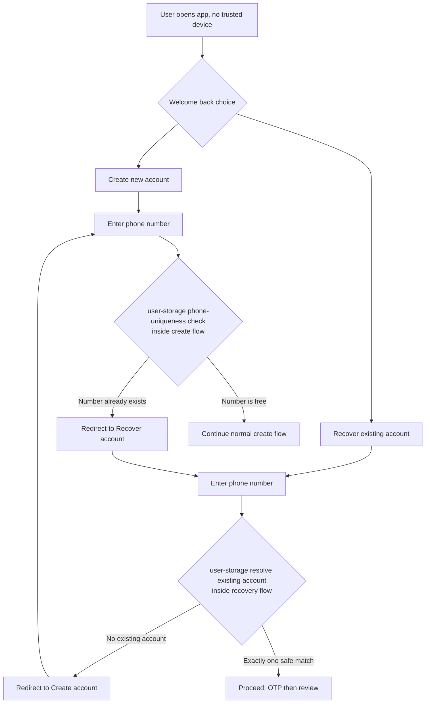

# Azamra Account Recovery — User-Storage Owned Flow Architecture

## Purpose

This document defines the **new** account-recovery architecture in which the recovery **case
creation and flow orchestration are owned by the user-storage backend** (`keybound-backend`)
as a declarative state-machine flow — the same engine that drives account creation
(`phone_otp`, `device_enroll`, `id_document`, …). The Kotlin BFF (`azamra-tokenization-bff`)
stops owning recovery state and returns to being a **thin facade**: it authenticates/proxies
requests and never becomes a second source of truth for a recovery case.

The product and journey rules are unchanged and remain the single source of truth in
[`azamra-tokenization-frontend/docs/account-recovery-architecture.md`](../../azamra-tokenization-frontend/docs/account-recovery-architecture.md)
and the API contract in
[`azamra-tokenization-frontend/docs/account-recovery-api-specification.md`](../../azamra-tokenization-frontend/docs/account-recovery-api-specification.md).
All **security non-negotiables and best practices in those documents remain in force**. This
document only changes **where** the recovery case lives and how its state machine is executed.

### What changed vs the previous design

| Aspect | Previous | Now |
|---|---|---|
| Case creation | BFF (`AccountRecoveryService.kt`, Redis) | **user-storage** flow engine (`flow_session`/`flow_instance`/`flow_step`, Postgres) |
| Case state machine | BFF Kotlin (`AccountRecoveryService.kt`) | **user-storage** declarative flow (YAML + Rust steps) |
| OTP / evidence / review | BFF services + staff controller | **user-storage** flow steps + existing `staff_flow` API |
| Binding / old-device policy | BFF calls user-storage bind/policy | **user-storage** flow steps calling existing bind/policy repos |
| BFF role | Orchestrator | **Thin facade** (auth, proof verification, proxying) |

## Principles

- Recovery **never creates a user**.
- Recovery **always starts from a case** and **always requires KYC Manager approval** before a
  new phone is bound.
- The new phone must **prove it owns its private key** before binding.
- One case completes **only once**.
- Account existence must not be trivially enumerable.
- Old devices are notified, then revoked/quarantined per policy after approval.
- Money movement can be restricted after a risky recovery.
- KYC Manager review is audited.

These match the existing non-negotiable list; the migration must not weaken any of them.

## System Context

```mermaid
flowchart LR
    subgraph Clients
        M[Mobile app<br/>recovery screens]
        K[KYC Manager app<br/>kyc-mgr]
        KC[Keycloak<br/>recovery SPI]
    end

    subgraph BFF["Kotlin BFF (thin facade)"]
        PF[Recovery proof filter / headers]
        AP[Typed recovery API impl]
        FX[Proxy / mapping layer]
    end

    subgraph US["user-storage backend (keybound-backend)"]
        FE[Flow engine<br/>registry · runtime · executor · worker]
        BF[bff_flow API<br/>sessions · flows · steps]
        SF[staff_flow API<br/>admin steps]
        KCX[/kc surface]
        RP[Recovery bind · old-device policy · lookup]
        DB[(Postgres<br/>flow_session · flow_instance · flow_step<br/>device · recovery_idempotency)]
    end

    M -->|/public/account-recoveries*| PF
    PF --> AP --> FX --> BF
    K -->|/staff/recovery-cases*| FX --> SF
    KC --> KCX
    BF --> FE
    SF --> FE
    FE --> DB
    KCX --> RP --> DB
    RP --> DB
```

Ownership rule: **the recovery case aggregate lives only in user-storage's Postgres.** The BFF
has no recovery-case storage of its own.

## The Recovery Flow As A State Machine

The recovery case is modeled as a **session + flow** in the existing engine. Recommended names
(following the API specification's internal model):

- `sessionType: account_recovery`
- `flowType: account_recovery`
- YAML: `flows/account_recovery.yaml`
- custom Rust steps: `app/crates/backend-server/src/flows/definitions/account_recovery.rs`

The case's canonical states are mapped onto flow steps. The state table from the API
specification is preserved:

| Status | Meaning | Who Moves It Forward |
|---|---|---|
| `CREATED` | Case exists, no usable evidence yet. | user-storage evidence steps |
| `EVIDENCE_REQUIRED` | User must provide OTP / evidence. | user-storage / mobile |
| `PENDING_REVIEW` | Evidence ready for KYC Manager review. | user-storage → staff_flow |
| `NEEDS_MORE_EVIDENCE` | Reviewer requested more evidence. | staff_flow / assisted channel |
| `APPROVED` | KYC Manager approved this exact case + key thumbprint. | staff_flow |
| `BINDING` | Final key binding in progress. | user-storage bind step |
| `COMPLETED` | New key bound; old-device policy applied. | terminal |
| `REJECTED` / `LOCKED` / `EXPIRED` / `CANCELLED` | Terminal outcomes. | terminal |

### Flow steps (declarative)

```text
resolve_existing_account
  → issue_recovery_otp
  → verify_recovery_otp
  → collect_assisted_evidence
  → await_admin_decision        (actor ADMIN → staff_flow)
  → record_admin_decision
  → await_new_key_proof
  → keycloak_recovery_bind      (or user-storage device-bindings)
  → revoke_or_quarantine_old_devices
  → apply_restrictions
  → complete_recovery
```

Phase-based expiry (unchanged from the API spec): 30-min active/OTP window, 7-day review
window, 7-day approved/binding window, re-armed only on state-changing transitions; reads and
staff views never re-arm.

## Main User Journey (Sequence Diagram)

The user journey is unchanged:

> User loses app data → opens app → **Recover account** → enter phone → verify OTP → provide
> evidence via WhatsApp / assisted channel → KYC Manager reviews → user completes recovery and
> returns to their existing account.

```mermaid
sequenceDiagram
    autonumber
    participant U as User
    participant M as Mobile app
    participant BFF as BFF (thin facade)
    participant US as user-storage (flow engine)
    participant OTP as OTP / SMS provider
    participant KYCM as KYC Manager (staff_flow)
    participant KC as Keycloak recovery SPI
    participant REG as Device registry (user-storage)

    U->>M: Opens app (no trusted device)
    M->>M: Show "Create account / Recover account"
    U->>M: Recover account + phone number
    M->>M: Generate new device keypair
    M->>BFF: POST /public/account-recoveries<br/>(proof headers)
    BFF->>BFF: Verify recovery proof headers (ES256, nonce, timestamp)
    BFF->>US: create session + add_flow_to_session (account_recovery)
    US->>US: resolve_existing_account (enumeration-safe lookup)
    alt Existing account matched
        US->>OTP: Send OTP to stored registered phone number
        OTP-->>M: OTP delivered (masked target only)
        U->>M: Enters OTP
        M->>BFF: POST .../otp/verify (proof headers)
        BFF->>US: submit_step (verify_recovery_otp)
        US-->>M: accepted / status=PENDING_REVIEW
        US->>KYCM: await_admin_decision (WAIT actor ADMIN)
        U->>KYCM: Provides evidence via WhatsApp / app / liveness
        KYCM->>US: submit_admin_step (approve / reject / more evidence)
        US-->>KYCM: decision recorded (expectedVersion enforced)
        M->>BFF: POST .../complete (final private-key proof)
        BFF->>US: complete_recovery flow step
        US->>KC: recovery-bind (approved case + final key proof)
        KC->>REG: bind new key; revoke/quarantine old devices atomically
        REG-->>KC: bound existing user id
        KC-->>US: BOUND
        US-->>M: COMPLETED + userId + restrictions
        M->>M: Save userId, clear recovery storage, normal device_key login
    else No safe match (unknown/unclear/different number)
        US-->>BFF: same public shape, no OTP sent, case review-only
        BFF-->>M: generic response (no existence disclosure)
    end
```

## Routing Between Create Account and Recover Account

A deliberate product rule governs which entry the user takes. It must not turn the create or
recover entry into a phone-number existence oracle on its own, so the routing decision is made
inside an active, rate-limited flow, never by a bare membership probe.



Notes:

- **Create → Recover:** if the phone already exists on an account, the create flow steers the
  user to recovery instead of silently creating a second account.
- **Recover → Create:** if the phone does not resolve to an existing account, the recovery flow
  steers the user to account creation.
- Both checks reuse the **enumeration-safe** primitives already in user-storage
  (`find_users_by_phone` / `lookup-users-by-phone`), keep the same generic public response
  shape for ambiguous cases, and are rate-limited. The redirect is a product affordance after
  the user is already engaged in a flow; it is never a cheap standalone probe.
- The BFF never answers "does this number exist" on its own; it only relays user-storage's
  flow output.

## Responsibilities By Component

| Component | Responsibility |
|---|---|
| **Mobile app** | Generate new device key; start recovery; submit OTP/evidence; poll status; complete approved recovery; then normal device-key login. |
| **BFF (thin facade)** | Verify recovery **proof headers** (ES256 signature, JKT, nonce, timestamp, token); enforce idempotency header presence; map/proxy typed mobile + staff requests to user-storage; expose typed `RecoveryCaseProjection` to Keycloak; never store recovery case state. |
| **user-storage (keybound-backend)** | Own the recovery **case aggregate** and the full state machine (flow engine); phone/account matching; OTP issue/verify/resend/lockout; evidence intake; staff review via `staff_flow`; binding + old-device policy + restrictions + completion; Postgres persistence + audit. |
| **KYC Manager** | Show typed recovery queue/detail; collect reviewer decision; submit approval/rejection/needs-more-evidence with `expectedVersion` + checklist. |
| **Keycloak recovery SPI** | Issue recovery-bind challenge; perform recovery bind only against an approved case; never create users. |

### API wiring

- **Mobile → BFF:** `/public/account-recoveries*` (unchanged shape, `security: []` + recovery
  proof headers). BFF verifies proof then proxies to user-storage `bff_flow`.
- **BFF → user-storage (mobile):** `create_session`, `add_flow_to_session`, `submit_step`,
  `get_flow`, `get_step` under `/bff/*`.
- **KYC Manager → user-storage:** typed `/staff/recovery-cases*` (proxied by BFF or direct)
  backed by `staff_flow` `/flow/sessions`, `/flow/steps/{step_id}`, `submit_admin_step`.
- **Keycloak → user-storage:** `/kc` recovery surface; and the existing
  `POST /v1/recoveries/{caseId}/device-bindings`,
  `POST /v1/recoveries/{caseId}/old-devices/policy`,
  `POST /users/lookup-by-phone` remain authoritative for binding/policy/matching.

## Data Model (user-storage)

The flow engine already provides the durable store. Recovery adds no second aggregate.

- `flow_session` (type `account_recovery`) — top-level case container, holds opaque case id +
  context.
- `flow_instance` (type `account_recovery`) — the running flow.
- `flow_step` — one row per executed/awaited step (audit + state).
- `device` — new key bound to existing `user_id`.
- `recovery_idempotency`, `old_device_policy_idempotency` — idempotency for the two
  finalization operations.
- New: a lightweight `recovery_case` aggregate (or extended `flow_session` context) to carry
  fields the generic flow context alone should not (hashed phone, OTP hash, decision, checklist,
  restrictions, phase deadlines) — see `Net-new in user-storage`.

**Net-new in user-storage (to be built):**

1. `recovery_case` table/aggregate (today a recovery case is only an opaque string in the two
   idempotency tables).
2. `flows/account_recovery.yaml` + custom Rust steps encoding the 11-state semantics.
3. OTP **resend** action + persistent **lockout/cooldown** (the SDK covers issue/verify/tries).
4. **OTP hashing** (store `otpHash`, not plaintext in JSONB).
5. Flow-level **idempotency** (today only the two finalization endpoints are idempotent).
6. **Keycloak session revocation** bridge for finalization.
7. Proof-signature verification must remain in the BFF (thin facade) or a trusted bridge, not be
   silently dropped.

## Security Requirements Preserved (Non-Negotiables)

The following from the existing docs **must remain**, regardless of where the case lives:

- Recovery never creates a user; the user never supplies the target `userId`.
- OTP goes only to the stored registered phone number.
- OTP is not enough on its own for full access.
- The new phone must prove it owns the new private key (final key proof) before binding.
- One recovery case completes only once; idempotency keys are required on mutations.
- Phone-number search must not reveal whether a number exists (enumeration-safe,
  rate-limited).
- Old devices are notified, then revoked/quarantined per policy after approval.
- Money movement can be restricted after a risky recovery.
- KYC Manager review is audited; reviewer identity comes from the staff token.
- Do not log OTPs, tokens, signatures, full public keys, raw phone numbers, balances, or
  transaction details. Log hashed phones, case ids, thumbprints, decisions, reviewer actors.
- Binding/old-device policy/restrictions are derived server-side, never accepted from mobile.
- Fail closed on missing signing secrets, session-invalidation failures, or dependency
  unavailability.

## Phased Rollout

1. Build `recovery_case` aggregate + `account_recovery` flow graph in user-storage.
2. Move case **start → OTP → evidence → review** into the flow engine; keep finalization
   (bind/challenge/session revocation) in the BFF or a trusted bridge first.
3. Move staff review onto `staff_flow`; keep typed `/staff/recovery-cases` facade for KYC
   Manager.
4. Move binding + old-device policy + restrictions into the flow; keep Keycloak session
   revocation behind a trusted bridge.
5. Drain in-flight Redis cases in the BFF; backfill to Postgres; feature-flag the transition.
6. Remove the BFF's recovery-case storage, Redis stores, and orchestration once the flow has
   production soak.
7. Wire the create↔recover redirects; watch abuse and support metrics; roll out by realm/cohort.

## Testing Plan (unchanged acceptance)

- Start recovery with a matched registered phone returns `202` and sends OTP.
- Unknown phone returns the same public shape without revealing existence.
- Different phone number cannot use normal phone-number recovery.
- OTP success advances to review and does not bind.
- KYC Manager approval does not bind until mobile completes with final key proof.
- Complete fails before approval and succeeds only with the approved new device key.
- Old device cannot authenticate after revocation/quarantine.
- Idempotent retry of complete returns the original success; reused key with different body → `409`.
- Missing/invalid recovery signature → `401`; too many OTP attempts → `LOCKED`.
- Keycloak refuses bind if approval revision changed or session/cache invalidation fails.
- Create→Recover and Recover→Create redirects behave correctly.
- Logs and staff payloads redact OTP, tokens, signatures, full public keys, raw phone numbers.
