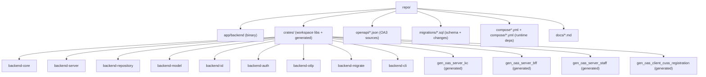
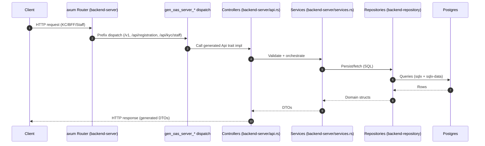
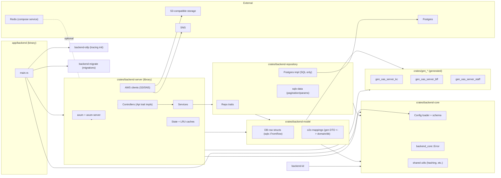
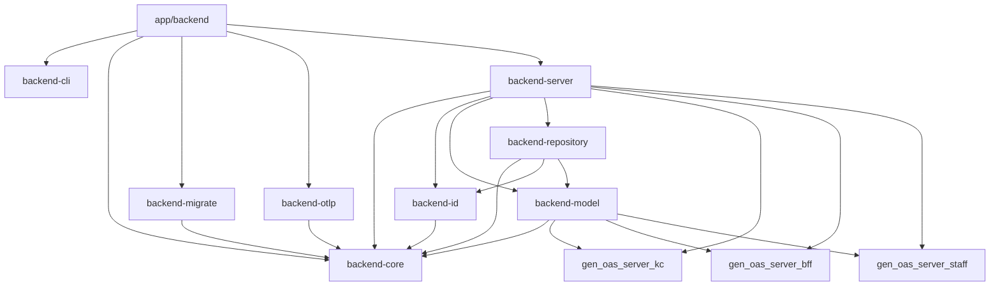
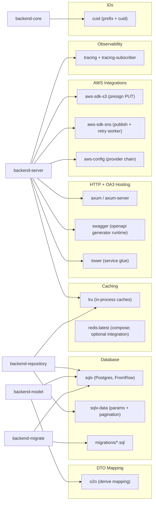
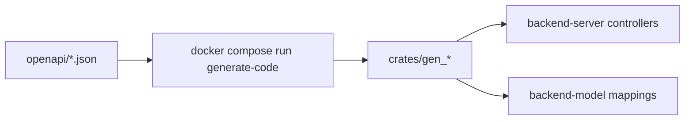

# Architecture

This project is a Rust workspace that exposes three OpenAPI (OA3) server surfaces (KC, BFF, Staff) using `axum`, with a strict MVC-style layering:

- **Controllers** (HTTP/OpenAPI boundary) live in `crates/backend-server`
- **Services** (business logic) live in `crates/backend-server`
- **Repositories** (SQL only) live in `crates/backend-repository`
- **DB models** (SQL row structs + DTO mapping) live in `crates/backend-model`
- **Config + errors + shared utilities** live in `crates/backend-core`

Generated crates in `crates/gen_*` are **never edited manually**; changes come from `openapi/*` + regeneration.

## Project Structure (Directories)

## Runtime Request Flow (MVC)

## Crate Relationships (Layered)

## Crates Node Graph (Workspace Dependency Sketch)

This is the intended dependency direction (lower layers never depend on upper layers):

## Library Usage (Where/How)

## OpenAPI Regeneration Workflow

All API surface changes start in `openapi/*.json` and flow into generated crates:

