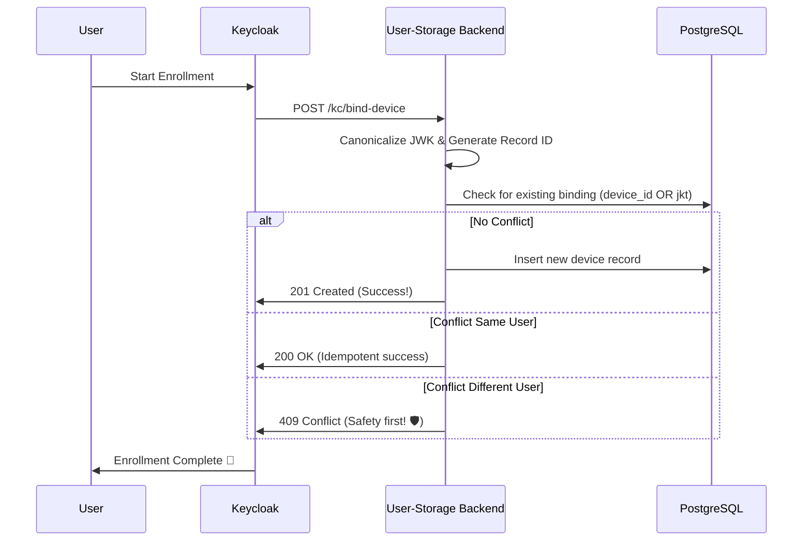

# Device Binding & Safety 📱

## Why?
We need to ensure that a user's account is securely bound to their physical device! 📱 This prevents unauthorized access and ensures that sensitive operations are only performed from trusted devices. 🛡️✨

## Actual
Our device binding logic ensures that each device is uniquely identified by both a `device_id` and a `jkt` (JWK Thumbprint). 🛠️

### Enrollment Flow
When a user enrolls a new device:
1. **JWK Canonicalization**: We sort the public JWK keys alphabetically to ensure a deterministic string representation. 📏
2. **Deterministic Record ID**: We derive a unique `device_record_id` from the `device_id` and the SHA-256 hash of the sorted JWK. ✨
3. **Uniqueness Check**: We enforce uniqueness on both `device_id` and `jkt` at the database level to prevent race conditions! 🛡️

## Constraints
- **Prefix + CUID2**: All user and device IDs use our mandatory prefixing system (`usr_*`, `dvc_*`). 📏
- **No UUIDs**: We strictly avoid UUIDs for backend IDs. 🙅‍♂️
- **Last Seen Tracking**: We refresh `last_seen_at` on every device lookup to keep usage tracking accurate! 🕒

## Findings
We've found that deterministic `device_record_id` generation is a lifesaver for handling retries and idempotent binds! 🚀 It ensures that even if a request is sent multiple times, we always end up with a consistent and safe state. ✨

## How to?
To lookup a device in your code:
1. Use the `DeviceRepo::lookup_device` method.
2. Provide either the `device_id` or `jkt` (or both!). 🛠️
3. The repository will handle the `last_seen_at` update automatically for you! ✨

## Conclusion
Our device binding system is built for maximum safety and reliability! 🛡️ It's the foundation of our trusted device ecosystem. 🥳✨
