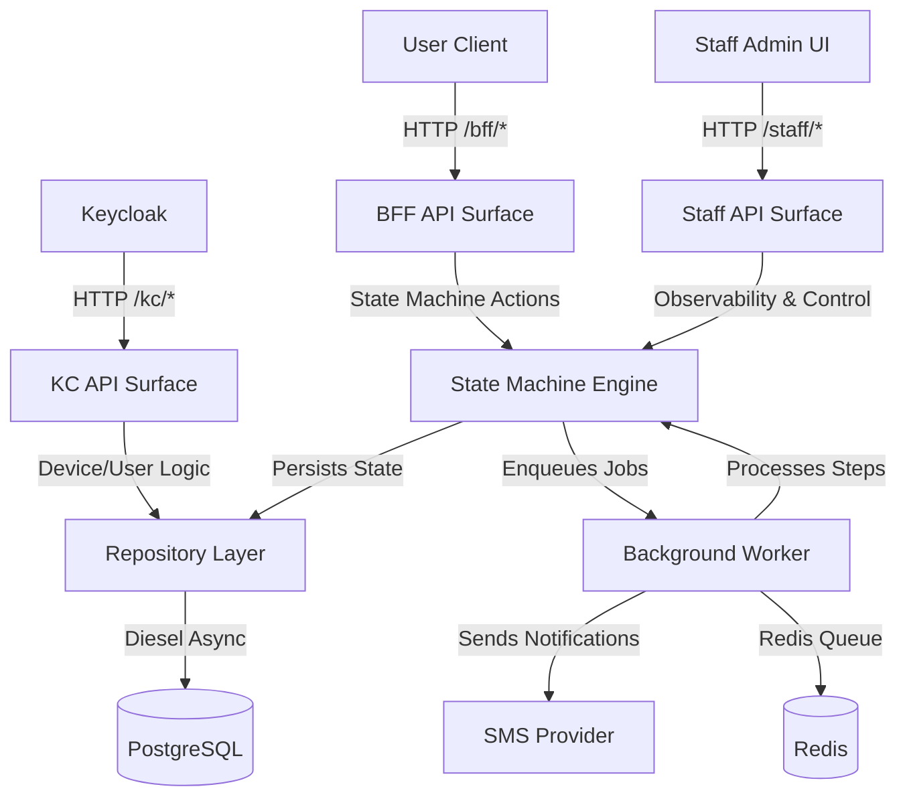

# Architecture Overview 🏗️

## Why?
We needed a system that can handle multiple types of requests (BFF for users, KC for Keycloak, Staff for admins) with high reliability and a shared core logic! A centralized architecture ensures consistency and makes development a breeze! ✨

## Actual
Our architecture is built on top of a centralized state-machine engine and three distinct API surfaces that share the same core services. 🛠️

## Constraints
- All APIs are served by a single `axum` binary but nested under different paths.
- We maintain a strict `controller -> repository` layering.
- Shared logic is abstracted into traits for easy mocking and testing. 🧪

## Findings
We've found that this modular approach allows us to scale the API surfaces independently (if we ever need to!) while keeping the business logic centralized in the state machine and repository layers. 🚀

## How to?
To add a new API endpoint:
1. Update the corresponding OpenAPI file in `openapi/`.
2. Regenerate the models and interfaces.
3. Implement the new interface method in `app/crates/backend-server/src/api/`.
4. Add any necessary repository logic in `app/crates/backend-repository/src/pg/`.

## Conclusion
Our architecture is designed to be robust, observable, and easy to extend! We're excited to see what you build with it! 🥳
