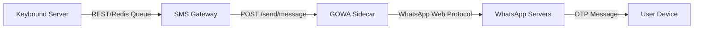

# WhatsApp (GOWA) Integration & Testing Guide

This guide describes the architecture, configuration, pairing, testing, and troubleshooting of the **GOWA (go-whatsapp-web-multidevice)** WhatsApp sidecar integration within the Keybound Backend's SMS Gateway.

---

## Architecture Overview

The system uses GOWA as a sidecar provider for sending OTP codes over WhatsApp, with automatic fallback to alternative providers:



- **SMS Gateway**: Built in Rust (`app/bins/sms-gateway`). When configured with `provider: whatsapp`, it delegates all SMS sending requests to GOWA via `WhatsappSmsProvider`.
- **GOWA Sidecar**: A Golang-based WhatsApp multi-device REST API, running inside Docker using the `aldinokemal2104/go-whatsapp-web-multidevice` image.
- **Fallback SMS Provider**: When the primary provider fails, `FallbackSmsProvider` tries each fallback provider in order until one succeeds.

### Rust Implementation

- **`WhatsappSmsProvider`** (`app/bins/sms-gateway/src/sms_provider.rs`): Translates `send_otp` calls into HTTP `POST /send/message` requests to the GOWA sidecar, with optional `device_id` query parameter and basic auth support.
- **`FallbackSmsProvider`** (`app/bins/sms-gateway/src/sms_provider.rs`): Accepts a list of providers and tries each in order, logging warnings on failure until one succeeds.
- **`WhatsappConfig`** (`app/crates/backend-core/src/config.rs`): Holds `base_url` (required), optional `device_id` for GOWA multi-device support, and optional `username`/`password` for basic auth.
- **`SmsProviderType::Whatsapp`** (`app/crates/backend-core/src/config.rs`): Enum variant that selects the WhatsApp provider at startup.

---

## 1. Local Configuration

Ensure the WhatsApp provider settings are configured in your configuration files (e.g., `config/dev.yaml` or `config/local.yaml`):

### WhatsApp as primary provider

```yaml
sms:
  provider: whatsapp
  whatsapp:
    base_url: "http://whatsapp-provider:3000"
    device_id: "default"         # Optional: defaults to the only registered device
    # username: "admin"          # Optional: basic auth for GOWA sidecar
    # password: "secret"         # Optional: basic auth for GOWA sidecar
  fallback:
    - provider: console    # Fallback — logs to stdout if WhatsApp fails
```

### WhatsApp as fallback provider

```yaml
sms:
  provider: orange
  orange:
    client_id: "..."
    client_secret: "..."
    token_url: "..."
    sms_base_url: "..."
    contract_url: "..."
  fallback:
    - provider: whatsapp
      whatsapp:
        base_url: "http://whatsapp-provider:3000"
        username: "admin"
        password: "secret"
```

---

## 2. Launching GOWA Sidecar

To spin up GOWA and start the SMS Gateway:

```bash
# Start GOWA and its dependencies (Postgres, Redis, MinIO)
docker compose up -d whatsapp-provider

# Verify the container is running and check its logs
docker compose logs -f whatsapp-provider
```

### Basic Auth

GOWA supports basic authentication via the `APP_BASIC_AUTH` environment variable (or `--basic-auth` CLI flag). The format is `username:password`, comma-separated for multiple credentials. The compose file includes this by default:

```yaml
# deploy/compose/app.compose.yml
whatsapp-provider:
  environment:
    - APP_BASIC_AUTH=${WHATSAPP_BASIC_AUTH:-admin:secret}
```

To enable basic auth on the SMS Gateway side, uncomment the `username` and `password` fields in your config:

```yaml
# config/dev.yaml
sms:
  whatsapp:
    base_url: "http://whatsapp-provider:3000"
    username: "admin"      # Must match APP_BASIC_AUTH username
    password: "secret"     # Must match APP_BASIC_AUTH password
```

> [!WARNING]
> **Port Conflict Troubleshooting:**
> If GOWA fails to start with a port binding error on port `3030`:
> 1. Check if a host process is already occupying port `3030`:
>    ```bash
>    ss -tlnp | grep 3030
>    ```
> 2. If a process like `whatsapp-native` is running on the host, terminate it:
>    ```bash
>    killall whatsapp-native
>    ```
> 3. Restart the container:
>    ```bash
>    docker compose up -d whatsapp-provider
>    ```

---

## 3. Interactive Device Pairing

GOWA must be paired with an active WhatsApp account before it can send messages. You can pair it interactively using either a **QR Code** or a **Pairing Code**.

### Step A: Register a Device Slot
First, allocate a device slot in GOWA:

```bash
curl -i -X POST \
  -H "Content-Type: application/json" \
  -d '{"device_id": "default"}' \
  http://localhost:3030/devices
```

*Expected Response (`200 OK`):*
```json
{
  "code": "SUCCESS",
  "message": "Device added",
  "results": {
    "id": "default",
    "state": "disconnected",
    ...
  }
}
```

---

### Step B: Pair WhatsApp Account

Choose one of the two pairing methods below:

#### Option 1: Pairing via QR Code (Recommended)
1. Open your browser and navigate to the GOWA status page:
   [http://localhost:3030](http://localhost:3030)
2. You can also retrieve the QR code directly via API:
   ```bash
   curl -i http://localhost:3030/devices/default/login
   ```
3. Open **WhatsApp** on your phone.
4. Go to **Settings** > **Linked Devices** > **Link a Device**.
5. Scan the QR code displayed on the screen.

#### Option 2: Pairing via Phone Number & Code
If scanning a QR code is not convenient, request a pairing code instead:

```bash
curl -i -X POST \
  "http://localhost:3030/devices/default/login/code?phone=YOUR_PHONE_NUMBER"
```
*(Ensure `YOUR_PHONE_NUMBER` includes the country code, e.g., `15551234567` or `491701234567`)*

*Expected Response (`200 OK`):*
```json
{
  "code": "SUCCESS",
  "message": "Pairing code generated",
  "results": {
    "code": "ABCD-1234"
  }
}
```

1. Open **WhatsApp** on your phone.
2. Go to **Settings** > **Linked Devices** > **Link a Device** > **Link with phone number instead**.
3. Enter the 8-character code displayed in the API response.

---

### Step C: Verify Connection Status
Verify that the device status shows `"connected"` and `"is_logged_in": true`:

```bash
curl -i http://localhost:3030/devices/default/status
```

Or query GOWA's app connection status:
```bash
curl -i -H "X-Device-Id: default" http://localhost:3030/app/status
```

Verify end-to-end connectivity from inside the Docker network:
```bash
docker run --rm --network keybound-backend_default alpine:3.20 sh -c '
  apk add -q curl
  echo "SMS Gateway: $(curl -s -m 5 http://sms-gateway:3000/health)"
  echo "WhatsApp:    $(curl -s -m 5 http://whatsapp-provider:3000/health)"
'
```

Expected output:
```
SMS Gateway: {"ok":true}
WhatsApp:    {"ready":true,"authenticated":true}
```

---

## 4. Sending OTP via GOWA

Once your device is logged in, you can test OTP delivery.

### Option A: Testing directly via GOWA API
Test that GOWA is capable of sending messages directly:

```bash
curl -i -X POST \
  -H "Content-Type: application/json" \
  -d '{
    "phone": "RECIPIENT_PHONE_NUMBER",
    "message": "Your verification code is: 998877"
  }' \
  "http://localhost:3030/send/message?device_id=default"
```
*(Replace `RECIPIENT_PHONE_NUMBER` with the target phone number including country code, e.g., `15559876543`)*

---

### Option B: Testing via SMS Gateway API
Test the end-to-end integration by running the local SMS Gateway and firing a request at it:

1. Start the SMS Gateway locally in development mode:
   ```bash
   just dev-sms
   ```
2. Send an OTP request to the SMS Gateway:
   ```bash
   curl -i -X POST \
     -H "Content-Type: application/json" \
     -d '{
       "phone": "RECIPIENT_PHONE_NUMBER",
       "otp": "654321"
     }' \
     http://localhost:3000/otp
   ```
3. Check the SMS Gateway terminal logs. You should see it delegate the message to the WhatsApp provider and log a successful delivery status.

---

## 5. Fallback Testing

### Test 1: SMS Gateway with WhatsApp primary, Console fallback

```bash
curl -i -X POST http://sms-gateway:3000/otp \
  -H "Content-Type: application/json" \
  -d '{"msisdn": "237XXXXXXXXX", "otp": "123456"}'
```

Check the logs to see which provider handled the request:
```bash
docker compose logs sms-gateway
# Expect: "Using WhatsApp provider: http://whatsapp-provider:3000"
```

### Test 2: Fallback activation (transient error)

Stop the WhatsApp provider, then send another OTP — Console fallback should activate:

```bash
docker compose stop whatsapp-provider

# Send OTP — should fall back to Console
curl -i -X POST http://sms-gateway:3000/otp \
  -H "Content-Type: application/json" \
  -d '{"msisdn": "237XXXXXXXXX", "otp": "654321"}'

# Check logs — should show console output
docker compose logs --tail 10 sms-gateway
# Expect something like: "[WARN] SMS provider 1 failed, falling back to next: ..."
```

### Test 3: Restore WhatsApp after failure

```bash
docker compose start whatsapp-provider
# Wait for "ready:true" on /health
# Subsequent OTP requests use WhatsApp again (primary)
```

### Test 4: Full integration via app

Once the `app` service is running, the KYC flow sends OTPs via `SMS_SINK_URL=http://sms-gateway:3000`. Any OTP step (e.g., phone OTP verification) will traverse the fallback chain automatically.

```bash
docker compose up -d app
# Trigger an OTP flow via the BFF or Staff API
# The sms-gateway logs will show which provider served the request
```

---

## 6. API Troubleshooting & Common Errors

| Error Code | HTTP Status | Message | Cause / Solution |
| :--- | :--- | :--- | :--- |
| `DEVICE_ID_REQUIRED` | `400 Bad Request` | `device_id is required via X-Device-Id header...` | GOWA contains multiple device slots but no `X-Device-Id` header or `device_id` query param was specified in the request. Configure `whatsapp.device_id` in `config/dev.yaml`. |
| `INVALID_WA_CLI` | `500 Internal Error` | `your WhatsApp CLI is invalid or empty` | The device slot exists but it is not connected or logged in to WhatsApp. Follow the **Interactive Device Pairing** steps to link it. |
| `404 Not Found` | `404 Not Found` | *Empty* | A conflicting process (e.g., `whatsapp-native` running outside docker) is listening on port `3030`. Check port assignments and terminate the conflicting process. |
| `{"ready":false}` on /health | `200 OK` | WhatsApp Web not initialized yet | Wait 15--30s for GOWA to initialize. |
| `{"authenticated":false}` | `200 OK` | QR not scanned | Check logs for QR code, scan with phone. |
| `Connection reset by peer` | N/A | Transient network error | Rerun the CI job or retry the request. |
| `401 Unauthorized` | `401 Unauthorized` | `Unauthorized` | GOWA has basic auth enabled but the SMS Gateway is not configured with matching `username`/`password`. Set `whatsapp.username` and `whatsapp.password` in config, and ensure they match the `APP_BASIC_AUTH` env var on the GOWA container. |
| `provider: console` in logs | N/A | Config not picked up | Verify `config/dev.yaml` has `provider: whatsapp`. |